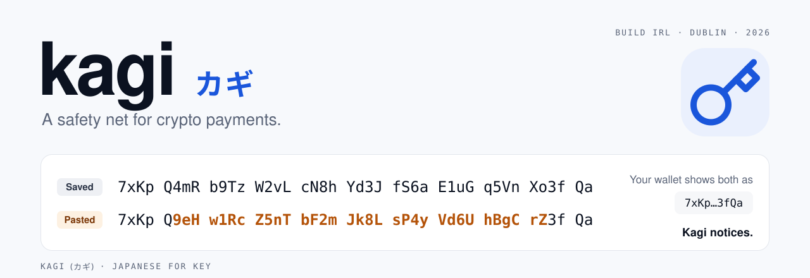
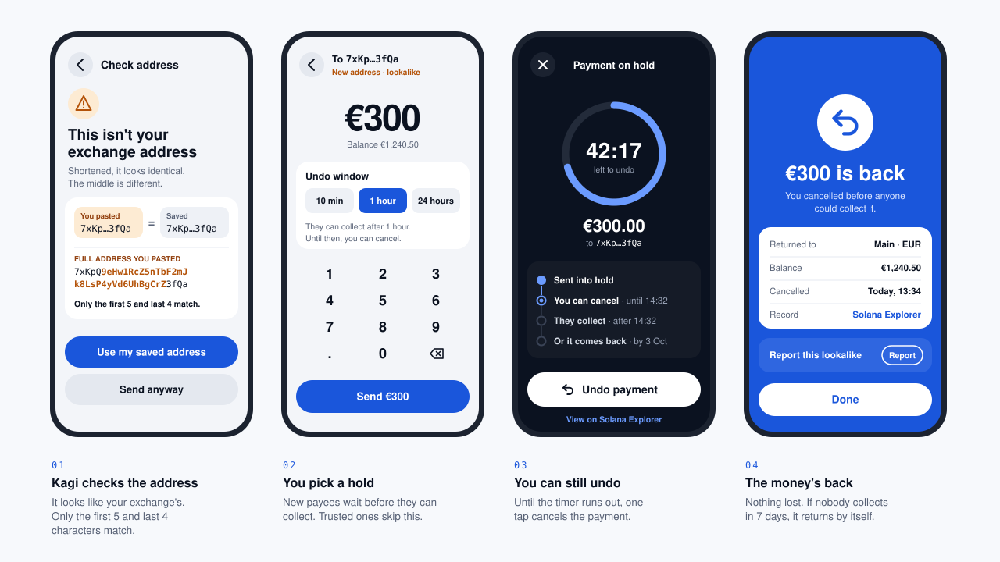

<picture>
  <source media="(prefers-color-scheme: dark)" srcset="img/banner-dark.svg">
  
</picture>

 

**Crypto payments you can take back.** Kagi (カギ, Japanese for *key*) is a wallet with a safety net built in. It catches lookalike addresses before you send, lets you undo a payment before it's collected, and brings money back from addresses nobody owns.

In crypto, whoever holds the key holds the money. Kagi is a key with a safety catch.

Built at BUILD IRL Vol. 1 · Superteam IE × Claude Builder Club × Solana · Dogpatch Labs, Dublin · 26 September 2026

 

## The problem

If you send money from your bank to the wrong person, there's a process for getting it back. If you send crypto to the wrong address, it's gone.

- About **$17 billion** was lost to crypto scams and fraud in 2025.[^1]
- **Address poisoning** is one of the cheapest scams to run. An attacker sends you a tiny payment from an address that starts and ends with the same characters as one you use, then waits for you to copy it from your history. In December 2025, one trader lost **$50 million** this way.[^2]
- Since **9 October 2025**, every eurozone bank has had to check a payee's name before a transfer goes out.[^3] Crypto wallets still check nothing.

## What Kagi does

It looks and feels like a banking app. The safety net underneath runs on Solana.

**Getting started is easy**

- Kagi can create the wallet for you, with a clean, simple setup.
- You get a username that reads like a name (`@saoirse`) instead of a 44-character address.

**Safety guards**

| Guard | What it checks | What you see |
| :-- | :-- | :-- |
| **New payee** | Have you sent money to this address before? | First-time payments are held for a short time. |
| **Lookalike** | Does it closely resemble an address you've used, or one that sent you dust? | The two addresses side by side, with the difference highlighted. |
| **Undo window** | Gives you time to change your mind. | A countdown and an **Undo** button. |
| **Auto-return** | Did anyone claim it? Catches typos and dead or invalid addresses. | The money comes back on its own, and you get a confirmation. |
| **Trusted payees** | Have you paid them before? | The payment goes straight through with no hold. |

## How it works

<picture>
  <source media="(prefers-color-scheme: dark)" srcset="img/flow-dark.svg">
  
</picture>

Under the hood, a protected payment doesn't go straight to the recipient. It goes into a hold enforced by a Solana program:

1. **Hold.** You can cancel, and nobody can collect it yet. You choose how long the hold lasts, from 10 minutes to 24 hours.
2. **Ready to collect.** The recipient claims the payment with their own key.
3. **Unclaimed after 7 days?** It returns to you automatically. Nobody controls a mistyped address, so nobody can ever claim from it. That means a typo is no longer permanent.

## Why Solana

- **Code enforces the hold, not a company.** Kagi never has custody of your money, and nobody can move it outside the program's rules, including us.
- **Fees cost a fraction of a cent,** so an extra step per payment costs almost nothing.
- **Every hold, cancel and return can be checked by anyone** on the Solana Explorer.

## Status

- [x] UI design (clickable prototype)
- [ ] Escrow program with hold, cancel, claim and auto-return (devnet)
- [ ] Address checks for first-time payees and lookalike addresses
- [ ] Wallet creation and usernames
- [ ] End-to-end demo on devnet

## What's next

- **Scam recall.** Partner with exchanges and fraud-intelligence services, so that a payment flagged as a scam during its hold window can be stopped before anyone collects it.
- **Proof of funds** *(stretch goal)*. A verifiable record of where your money came from, for things like house deposits.

 

[^1]: Chainalysis, [2026 Crypto Crime Report: Scams](https://www.chainalysis.com/blog/crypto-scams-2026/).
[^2]: NFT Plazas, [Crypto Scam & Fraud Statistics 2026](https://nftplazas.com/crypto-scam-fraud-statistics-2026/).
[^3]: European Commission, [New EU rules make instant euro payments faster and safer](https://finance.ec.europa.eu/news/new-eu-rules-make-instant-euro-payments-faster-and-safer-2025-10-10_en).
